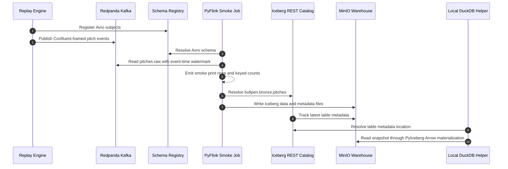

# Milestone 1 - Replay to Bronze

## Demo Checklist

- Start the local stack.
- Ensure `bronze.pitches` exists.
- Run the bronze Iceberg integration test.
- Show `[smoke_job]` lines for published pitcher IDs.
- Query `bronze_pitches` locally through `lakehouse.query`.
- Show the Iceberg metadata location changed after commit.
